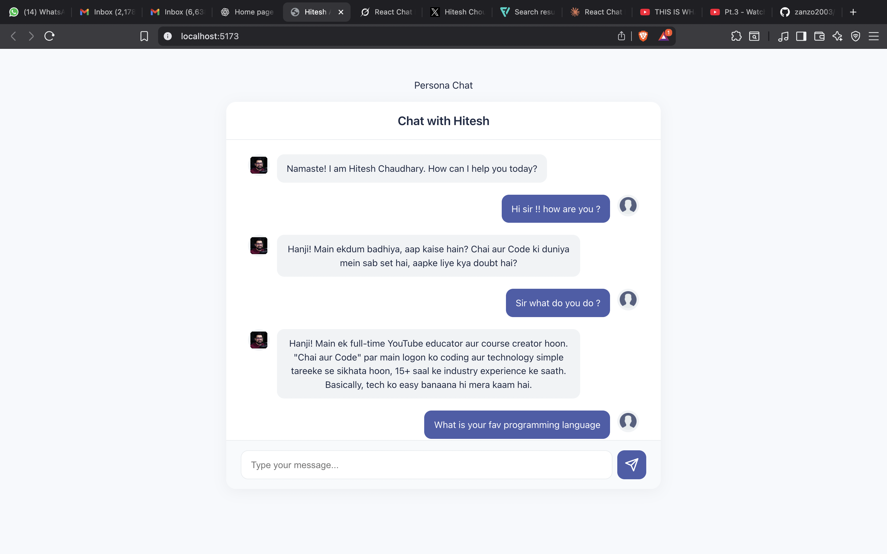

# AI Persona Chat

This project is a full-stack AI-powered chat application featuring a custom persona based on Hitesh Chaudhary, a renowned tech educator. The backend uses Node.js and Express to serve AI-generated responses, while the frontend is built with React and Vite for a modern, responsive chat interface.

---

## Project Structure

```
ai_persona_be/      # Backend (Express API for AI persona)
ai_persona_chat/    # Frontend (React + Vite chat UI)
```

---

## Features

- **AI Persona:** Chat with an AI that mimics Hitesh Chaudhary's teaching style and personality.
- **Modern UI:** Responsive, user-friendly chat interface.
- **Streaming AI Responses:** Backend integrates with OpenAI-compatible API (Gemini).
- **Environment-based Configuration:** Secure API keys and endpoints via `.env`.

---

## Getting Started

### Prerequisites

- Node.js (v18+ recommended)
- npm

---

### 1. Clone the Repository

```sh
git clone <your-repo-url>
cd <repo-root>
```

---

### 2. Backend Setup (`ai_persona_be`)

1. **Install dependencies:**
    ```sh
    cd ai_persona_be
    npm install
    ```

2. **Configure environment variables:**
    - Copy `.env` and set your API keys and base URI:
      ```
      GENAI_API_KEY=your_api_key_here
      GENAI_BASE_URI=https://generativelanguage.googleapis.com/v1beta/openai
      PORT=3000
      ```

3. **Start the backend server:**
    ```sh
    node server.js
    ```
    - The backend runs on [http://localhost:3000](http://localhost:3000).

---

### 3. Frontend Setup (`ai_persona_chat`)

1. **Install dependencies:**
    ```sh
    cd ai_persona_chat
    npm install
    ```

2. **Start the frontend dev server:**
    ```sh
    npm run dev
    ```
    - The frontend runs on [http://localhost:5173](http://localhost:5173).

---

## Usage

1. Open [http://localhost:5173](http://localhost:5173) in your browser.
2. Start chatting with the AI persona. The backend will generate responses in Hitesh Chaudhary's style.

---

## File Overview

- **Backend**
  - [`server.js`](../ai_persona_be/server.js): Express server, CORS setup, AI response endpoint.
  - [`src/services/aiService.js`](../ai_persona_be/src/services/aiService.js): Handles AI persona prompt and OpenAI API integration.
  - `.env`: API keys and config (not committed).

- **Frontend**
  - [`src/App.jsx`](src/App.jsx): Main React app, manages chat state.
  - [`src/components/ChatInterface.jsx`](src/components/ChatInterface.jsx): Chat UI component.
  - [`src/services/aiService.js`](src/services/aiService.js): Axios client for backend API.
  - [`src/styles/ChatInterface.css`](src/styles/ChatInterface.css): Chat UI styles.

---

## Customization

- **Persona Prompt:** Edit the system prompt in [`ai_persona_be/src/services/aiService.js`](../ai_persona_be/src/services/aiService.js) to change the AI's personality.
- **API Integration:** The backend uses OpenAI-compatible APIs; you can swap endpoints or models as needed.

---

## License

This project is for educational purposes.

---

## Credits

- Persona inspired by Hitesh Chaudhary.
- Built with [React](https://react.dev/), [Vite](https://vitejs.dev/), [Express](https://expressjs.com/), and [OpenAI](https://openai.com/).

---

## Troubleshooting

- Ensure both backend and frontend are running on their respective ports.
- Check `.env` for correct API keys and endpoints.
- If CORS issues occur, verify the `origin` in backend CORS settings.

---

## Screenshots



---

## Video Demo


Happy coding! Chai aur Code
